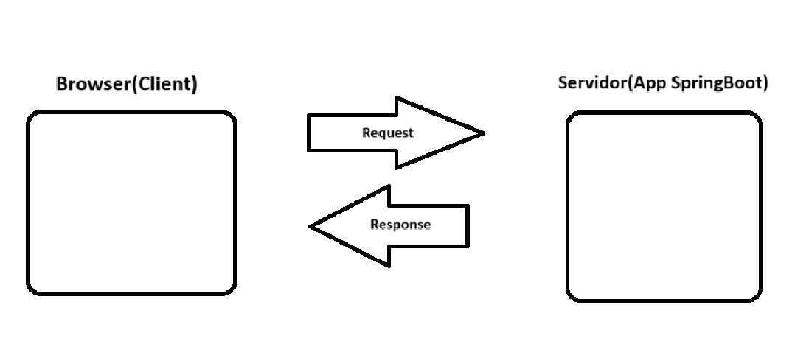

### Formas de executar a aplicação spring 

Executando via CLI o .JAR
```cmd
mvn spring-boot:run
```

Executa o arquivo gerado .JAR
```cmd
mvn clean install 
```

Esta pasta é padrão do MAVEN a onde fica configurado as dependencias dele.
```cmd
.m2/repository
```

Executando os arquivos .jar da aplicação.

Exemplo:

```cmd
java -jar target/spring-boot-project-fundamentals-0.0.1-SNAPSHOT.jar
```

Anotations são os @anotation

Exemplos:
\
@SpringBootApplication


### O que é uma SERVELET?
Servelet é a base do java para qualquer aplicação web que deseja-se criar.

### API REST


### Recursos (URLs) 

### HTTP Methods
    GET - Buscar uma informação
    POST - Inserir uma informação
    PUT - Atualizar uma informação
    DELETE - Remover uma informação

### Body (Parametro de corpo)
    {
        "username":"Celson Fernando"
    }

### Path Params
O path params faz parte da requisição.

#### Exemplo:
    https://app.bookstore.com.br/api/v2/cellphone
    https://app.bookstore.com.br/api/v2/games

### Query Params
 É adicionada a URL usando o caracter = **?**

##### Exemplo:
    https://app.bookstore.com.br/api/v2/cellphone?samsung=S24&=512

### Header Params
- Authorization
- Page